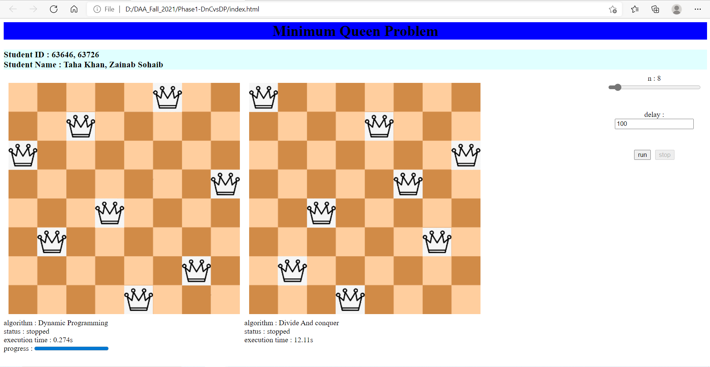

# DAA_Fall_2021
### PROJECT MEMBERS
StdID | Name
------------ | -------------
63726 | Zainab sohaib
63646 | Taha khan
### INTRODUCTION
## Partner#1
My name is zainab sohaib i am in 7th semester and im currently enrolled in fyp-1 , i have done 4 month internship as a web developer at American Technology.Further im trying to enhance and polish my web development skills.I like to travel and explore new things.
## Partner#2
My name is Taha Khan I'm in 7th semester and I'm currently enrolled in FYP-1, I'm a devops Engineer and I have been woking on cloud since 6 month and currntly working remotely with INet System Inc

# Minimum N-Queens Problem Simulator
I simulated minimum n-queens problem with two algorithms : **Divide & Conq** and **Dynamic Programming** using javascript language

This project helps you to see the process of solving n-queens problem using the two mentioned algorithms and compare the performance.

# JS Files Explanation
1. **js/DP-tools.js** : A light-weight tool box for DP algorithm contains several methods.
2. **js/chess-ui.js** : A Chess UI generator which takes an object of Engine class and visualize that engines steps.
3. **js/n-queens-DivideAndCoq-engine.js** : Divide And Conq engine to solve minimum n-queens problem.
4. **js/n-queens-DP-engine.js** : DP Algorithm based engine to solve Minimum n-queens problem.
# Demo
click [here](https://scintelligencia.com/taha/) to see online demo hosted on github pages

