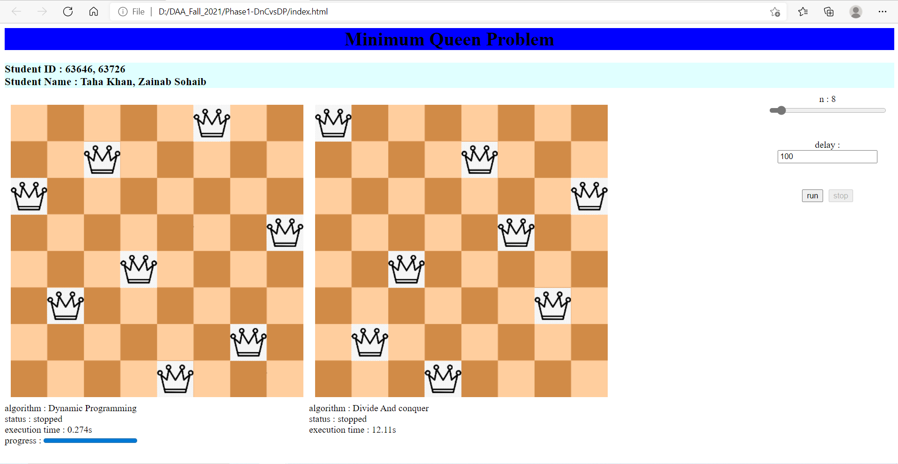

# DAA_Fall_2021
### PROJECT MEMBERS
StdID | Name
------------ | -------------
63726 | Zainab sohaib
63646 | Taha khan
### INTRODUCTION
## Partner#1
My name is zainab sohaib i am in 7th semester and im currently enrolled in fyp-1 , i have done 4 month internship as a web developer at American Technology.Further im trying to enhance and polish my web development skills.I like to travel and explore new things.
## Partner#2
My name is Taha Khan I'm in 7th semester and I'm currently enrolled in FYP-1, I'm a devops Engineer and I have been woking on cloud since 6 month and currntly working remotely with INet System Inc

# Minimum N-Queens Problem Simulator
We ahve  simulated minimum n-queens problem with two algorithms : **Divide & Conq** and **Dynamic Programming** using javascript language

This project helps you to see the process of solving n-queens problem using the two mentioned algorithms and compare the performance.

# JS Files Explanation
1. **js/DP-tools.js** : A light-weight tool box for DP algorithm contains several methods.
2. **js/chess-ui.js** : A Chess UI generator which takes an object of Engine class and visualize that engines steps.
3. **js/n-queens-DivideAndCoq-engine.js** : Divide And Conq engine to solve minimum n-queens problem.
4. **js/n-queens-DP-engine.js** : DP Algorithm based engine to solve Minimum n-queens problem.
# Website link
click [here](https://scintelligencia.com/taha/) to see online demo hosted on github pages

# Approach
there are two problem we face **first problem**is dynamic programing In this problem, in the
first row, the first square adds four new lines, and 
subsequent squares add three new semi-ex-
hausted lines apiece. The last square in the row 
exhausts two lines: the row, and one of its diago-
nals (namely, the short single-element diagonal). 
So after the first row there are 3n - 1 semi-ex-
hausted lines. The first square in the second row 
adds a new row line and a new diagonal line, and 
exhausts the other (two-element) diagonal, for a 
net gain of one line. The remaining squares in the 
second row have no effect until we get to the last 
square, which adds a new diagonal and exhausts 
the row line and a short (two-element) diagonal, 
for a net loss of one line. Subsequent rows be-
have like the second row. Again, the final row 
exhausts various lines, but that does not concern . 
The **second prolem** is divide and conquer In this problem 
In the 
array, the first square adds four new lines, and 
subsequent squares add three new semi-ex-
hausted lines apiece. The last square in the row 
exhausts two lines: the row, and one of its diago-
nals (namely, the short single-element diagonal). 
So after the first row there are 3n - 1 semi-ex-
hausted lines. The first square in the second row 
adds a new row line and a new diagonal line, and 
exhausts the other (two-element) diagonal, for a 
net gain of one line. The remaining squares in the 
second row have no effect until we get to the last 
square, which adds a new diagonal and exhausts 
the row line and a short (two-element) diagonal, 
for a net loss of one line. Subsequent rows be-
have like the second row. Again, the final row 
Merge all the lines subsequently

# References
* https://www.geeksforgeeks.org/n-queen-problem-backtracking-3/
* https://coderedirect.com/questions/505775/8-queen-problem-using-dynamic-programming
* https://www.geeksforgeeks.org/printing-solutions-n-queen-problem/
* https://developers.google.com/optimization/cp/queens
